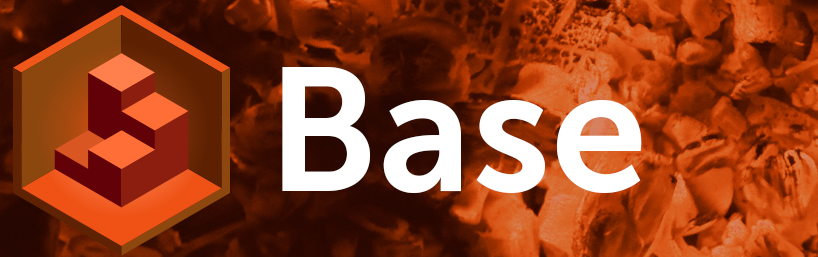

# viur-base


**viur-base** provides a basic ViUR project structure and template.<br>
This is the best place to start a new ViUR project from!

---

## Prerequisites

Before you start, please check out the following system prerequisites:

1. `git`, `python >= 3.9` and `pipenv` should be installed
2. [Google Cloud SDK](https://cloud.google.com/sdk/docs/install) with `app-engine-python` and `app-engine-python-extras` components (see [here](https://docs.viur.dev/latest/start.html#prerequisites) for further help)

---

## Start a new project

1. Create a new Google Cloud project [here](https://console.cloud.google.com/projectcreate) and activate billing
2. Clone this repository with `git clone https://github.com/viur-framework/viur-base.git YOUR-PROJECT`
3. `cd YOUR-PROJECT`
4. `./clean-base.py -A YOUR-APP-ID`
5. `./viur-gcloud-setup.sh YOUR-APP-ID`
6. Locally run your project with `pipenv run ./local_run.sh` or deploy it with `gcloud app deploy`.

See the [documentation](https://docs.viur.dev/latest/start.html#first-startup) for further help.

---

## Clean git history

It is recommended to clean the git history before you push your new project to a remote git repository. This can easily be done with

```bash
$ git checkout --orphan fresh  # create new orphaned branch with empty history
$ git branch -D main  # remove old viur-base main
```

After it, you can branch main from fresh again and remove fresh.

## Contributing

We take a great interest in your opinion about ViUR. We appreciate your feedback and are looking forward to hear about your ideas. Share your visions or questions with us and participate in ongoing discussions.

- [ViUR website](https://www.viur.dev)
- [#ViUR on freenode IRC](https://webchat.freenode.net/?channels=viur)
- [ViUR on GitHub](https://github.com/viur-framework)
- [ViUR on Twitter](https://twitter.com/weloveViUR)

---

## Credits

ViUR is developed and maintained by [Mausbrand Informationssysteme GmbH](https://www.mausbrand.de/en), from Dortmund in Germany. We are a software company consisting of young, enthusiastic software developers, designers and social media experts, working on exciting projects for different kinds of customers. All of our newer projects are implemented with ViUR, from tiny web-pages to huge company intranets with hundreds of users.

Help of any kind to extend and improve or enhance this project in any kind or way is always appreciated.

---

## License

Copyright (C) 2012-2021 by Mausbrand Informationssysteme GmbH.

Mausbrand and ViUR are registered trademarks of Mausbrand Informationssysteme GmbH.

You may use, modify and distribute this software under the terms and conditions of the GNU Lesser General Public License (LGPL).
See the file LICENSE provided within this package for more information.
